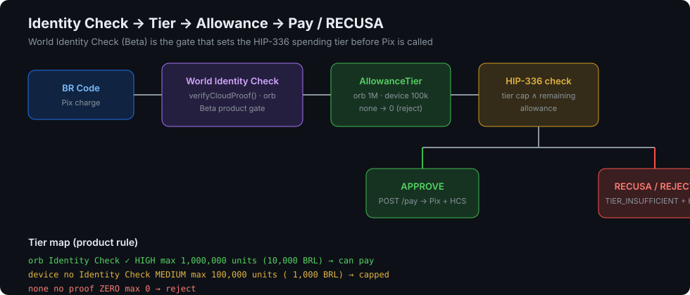
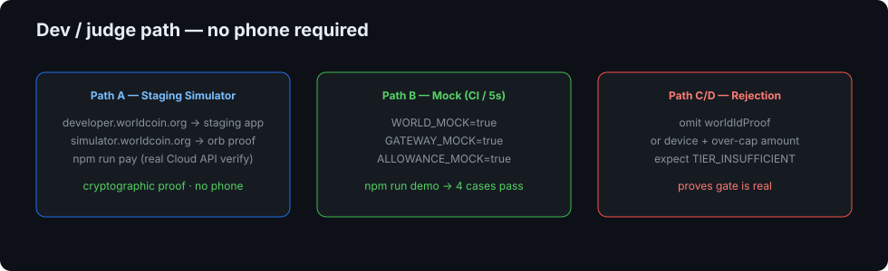
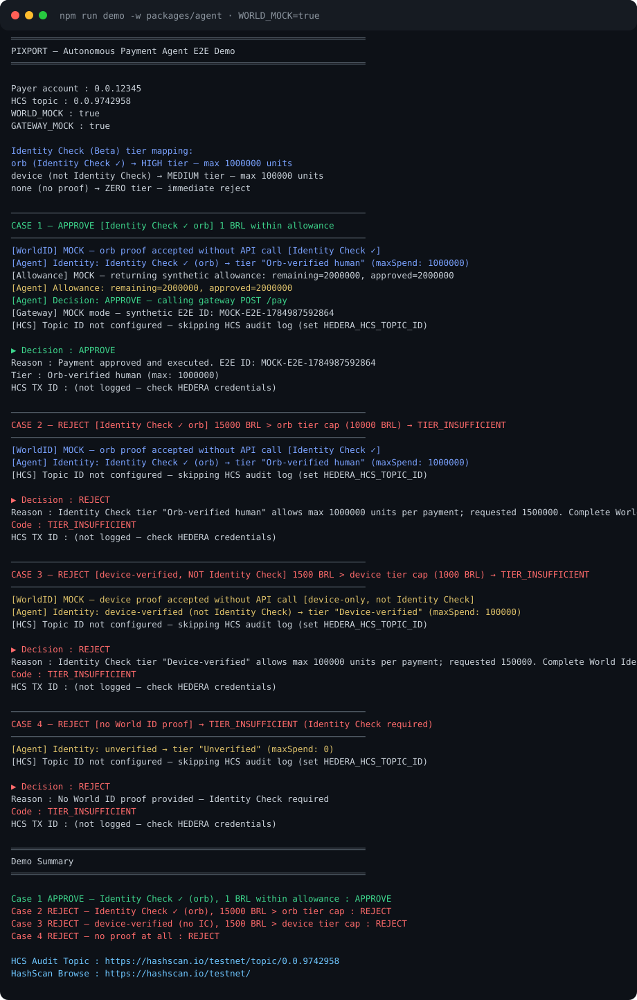
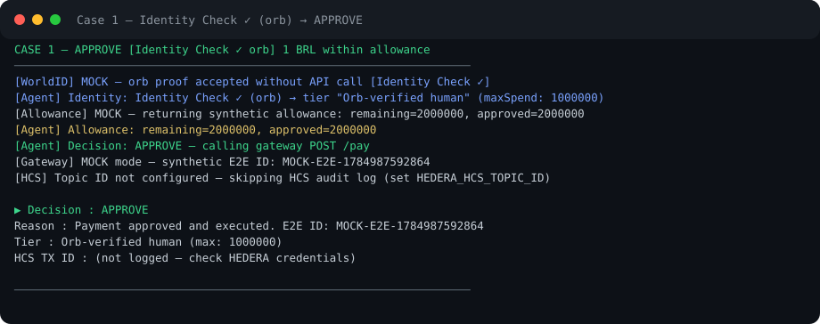
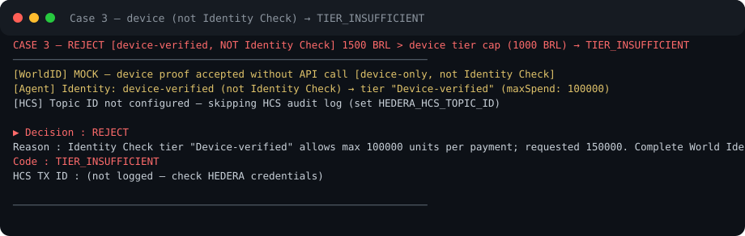
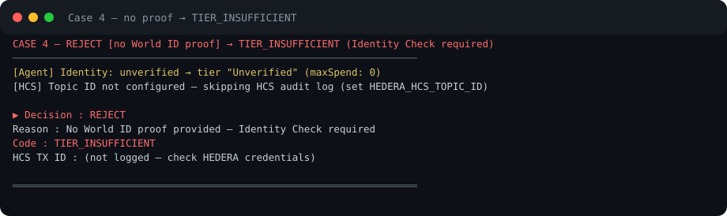
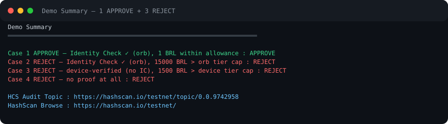
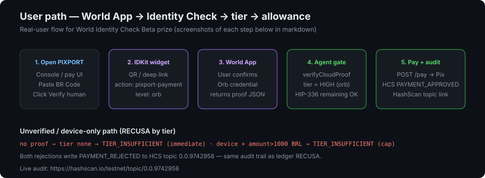

# World Identity Check (Beta) — Test Docs (Dev + User)

> **Prize track:** World Identity Check Beta  
> **Source implementation:** [`packages/agent`](../packages/agent) · [`DEV_TEST.md`](../packages/agent/DEV_TEST.md) · [`worldid.ts`](../packages/agent/src/worldid.ts)  
> **Evidence captured:** 2026-07-25 · `npm run demo -w packages/agent` exit 0  
> **HCS audit topic:** [0.0.9742958 on HashScan](https://hashscan.io/testnet/topic/0.0.9742958)

This document is the judge-facing proof that PIXPORT uses **World Identity Check (Beta)** — not generic World ID — as the gate that sets the payer's **HIP-336 allowance tier**. It covers:

1. Product rule: Identity Check → tier → allowance → pay / RECUSA  
2. **Dev path** (no phone): simulator + one-command mock demo with terminal screenshots  
3. **User path** (real World App): orb verification → HIGH tier → allowance unlocked  
4. What fails when Identity Check is missing or only device-level  

---

## 1. Product rule — Identity Check changes the allowance tier

```
BR Code → World Identity Check (Beta) → AllowanceTier → HIP-336 check → POST /pay → HCS log
```

| Identity Check result | Level | Tier | Max per payment | Outcome |
|----------------------|-------|------|-----------------|---------|
| **Identity Check ✓** (Orb-verified unique human) | `orb` | HIGH | 1,000,000 units (10,000 BRL) | Can pay within tier ∧ remaining allowance |
| Device-verified only (World App, **not** Identity Check) | `device` | MEDIUM | 100,000 units (1,000 BRL) | Hard cap; over-cap → `TIER_INSUFFICIENT` |
| No proof / failed verification | `none` | ZERO | 0 | Immediate `TIER_INSUFFICIENT` |

**SDK:** server-side `verifyCloudProof()` from `@worldcoin/idkit-core/backend` (v2).  
**Constant:** `IDENTITY_CHECK_LEVEL = "orb"` in `packages/agent/src/worldid.ts` — only orb counts as Identity Check.



**Why this matters for the prize:** the Identity Check result is not a cosmetic badge. It is the input that chooses the spending tier enforced before Pix is ever called. Unverified payers cannot spend; device-only payers cannot exceed 1,000 BRL; orb (Identity Check) unlocks the HIGH tier used in the happy-path demo.

---

## 2. Dev test path (judges — no phone)



Full step-by-step also lives in [`packages/agent/DEV_TEST.md`](../packages/agent/DEV_TEST.md). Below is the submission-facing summary with **captured terminal output**.

### Path B — Mock demo (recommended first; zero credentials)

One command. No World app_id, no Hedera keys, no phone.

```bash
WORLD_MOCK=true GATEWAY_MOCK=true ALLOWANCE_MOCK=true npm run demo -w packages/agent
```

**Captured run (2026-07-25) — exit 0:**



Raw log: [`world-identity-check/e2e-demo-terminal.txt`](./world-identity-check/e2e-demo-terminal.txt)

#### Case 1 — Identity Check ✓ (orb) → APPROVE



```
[WorldID] MOCK — orb proof accepted without API call [Identity Check ✓]
[Agent] Identity: Identity Check ✓ (orb) → tier "Orb-verified human" (maxSpend: 1000000)
▶ Decision   : APPROVE
  Tier       : Orb-verified human (max: 1000000)
```

#### Case 3 — device only (NOT Identity Check) → REJECT



```
[WorldID] MOCK — device proof accepted without API call [device-only, not Identity Check]
[Agent] Identity: device-verified (not Identity Check) → tier "Device-verified" (maxSpend: 100000)
▶ Decision   : REJECT
  Code       : TIER_INSUFFICIENT
  Reason     : ... requested 150000 ... Complete World Identity Check (orb verification) ...
```

**Product proof:** 1,500 BRL is legal for orb tier but illegal for device tier. Identity Check is what unlocks the higher allowance.

#### Case 4 — no proof → REJECT



```
[Agent] Identity: unverified → tier "Unverified" (maxSpend: 0)
▶ Decision   : REJECT
  Code       : TIER_INSUFFICIENT
  Reason     : No World ID proof provided — Identity Check required
```

#### Summary line judges should see



```
Case 1 APPROVE — Identity Check ✓ (orb),   1 BRL within allowance         : APPROVE
Case 2 REJECT  — Identity Check ✓ (orb),   15000 BRL > orb tier cap       : REJECT
Case 3 REJECT  — device-verified (no IC),  1500 BRL > device tier cap     : REJECT
Case 4 REJECT  — no proof at all                                          : REJECT
```

Case 2 shows even Identity Check holders are still bound by the HIGH tier cap (runaway spend protection). Cases 3–4 show the Identity Check gate itself.

### Path A — Staging Simulator (real cryptographic proof, still no phone)

1. Register a **Staging** app at [developer.worldcoin.org](https://developer.worldcoin.org)  
2. Create action `pixport-payment`, copy `app_staging_…`  
3. Set env:

```env
WORLD_APP_ID=app_staging_XXXXXXXXXXXXXXXXXXXXXXXXXXXXXXXX
WORLD_ACTION=pixport-payment
WORLD_ENV=staging
WORLD_MOCK=false
GATEWAY_MOCK=true
```

4. Open [simulator.worldcoin.org](https://simulator.worldcoin.org)  
   - `app_id` = staging id  
   - action = `pixport-payment`  
   - signal = payer Hedera account (e.g. `0.0.12345`)  
   - verification level = **`orb`** (Identity Check)  
   - Generate Proof → copy JSON  

5. Pipe into the agent:

```bash
echo '{
  "brCode": "00020126330014BR.GOV.BCB.PIX0111123456789010208PIXPORT52040000530398654041.005802BR5913PIXPORT Demo6009Sao Paulo62070503***6304A1B2",
  "payerAccountId": "0.0.12345",
  "mandateId": "mnd-judge-001",
  "amount": "1.00",
  "worldIdProof": {
    "proof": "<from simulator>",
    "merkle_root": "<from simulator>",
    "nullifier_hash": "<from simulator>",
    "verification_level": "orb",
    "signal": "0.0.12345"
  }
}' | npm run pay -w packages/agent
```

**Expected:** `[WorldID] Identity Check result: orb [Identity Check ✓ — Orb-verified human]` then `APPROVE` if allowance remains.

> Staging `app_id` for shared judge use: set in board secrets / VALIDATION.md when Felipe registers the team app. Path B remains fully reproducible without it.

### Path C — Unverified rejection (one-liner)

```bash
echo '{
  "brCode": "00020126330014BR.GOV.BCB.PIX0111123456789010208PIXPORT52040000530398654041.005802BR5913PIXPORT Demo6009Sao Paulo62070503***6304A1B2",
  "payerAccountId": "0.0.12345",
  "mandateId": "mnd-no-proof-001",
  "amount": "1.00"
}' | WORLD_MOCK=true GATEWAY_MOCK=true ALLOWANCE_MOCK=true npm run pay -w packages/agent
```

**Expected:** `TIER_INSUFFICIENT` — Identity Check required. With real Hedera credentials, rejection is also written to HCS topic [`0.0.9742958`](https://hashscan.io/testnet/topic/0.0.9742958).

---

## 3. User test path (real World App)



For a real human with **World App + Orb verification** (Identity Check level):

| Step | What the user does | What PIXPORT does | What to screenshot |
|------|--------------------|-------------------|--------------------|
| 1 | Opens PIXPORT console / pay UI, pastes BR Code | UI loads IDKit with `action: pixport-payment`, level `orb` | Console with BR Code + “Verify with World” |
| 2 | IDKit shows QR / deep link | Widget bound to production or staging `app_id` | IDKit modal |
| 3 | Approves in **World App** with Orb credential | App returns `ISuccessResult` with `verification_level: "orb"` | World App confirm screen + proof JSON (`orb`) |
| 4 | Frontend posts proof to agent / gateway | `verifyCloudProof()` → HIGH tier → HIP-336 remaining check | Agent log: `Identity Check ✓ (orb) → tier "Orb-verified human"` |
| 5 | Payment executes | `POST /pay` → Pix + `PAYMENT_APPROVED` on HCS | Pay success + [HashScan topic](https://hashscan.io/testnet/topic/0.0.9742958) |

### CLI equivalent (after World App returns proof)

```bash
# WORLD_ENV=production and production app_id for real Orb proofs
echo '{
  "brCode": "<real BR Code>",
  "payerAccountId": "0.0.XXXXX",
  "mandateId": "mnd-user-001",
  "amount": "1.00",
  "worldIdProof": {
    "proof": "<from World App>",
    "merkle_root": "<from World App>",
    "nullifier_hash": "<from World App>",
    "verification_level": "orb",
    "signal": "0.0.XXXXX"
  }
}' | npm run pay -w packages/agent
```

### Negative user paths (must be demos too)

| User state | Amount | Expected |
|------------|--------|----------|
| Skips World / no proof | any | `TIER_INSUFFICIENT` — Identity Check required |
| Device-verified only | 1,500 BRL | `TIER_INSUFFICIENT` — complete Identity Check (orb) for HIGH tier |
| Orb (Identity Check ✓) | 1 BRL within allowance | `APPROVE` + HCS `PAYMENT_APPROVED` |
| Orb (Identity Check ✓) | above HIGH tier or remaining allowance | `TIER_INSUFFICIENT` or allowance reject + HCS |

> **Live phone screenshots:** capture World App confirm + IDKit success on a physical device before final submission video; attach under `docs/world-identity-check/user-phone/` when available. Storyboard + CLI proof already demonstrate the product rule end-to-end.

---

## 4. How Identity Check ties to HIP-336 / RECUSA

Two complementary gates:

| Gate | Enforced by | Failure signal | Evidence |
|------|-------------|----------------|----------|
| **Identity Check → tier** | Agent (`worldid.ts` + `agent.ts`) | `TIER_INSUFFICIENT` | Demo cases 2–4 (this doc) |
| **HIP-336 allowance** | Hedera ledger | `AMOUNT_EXCEEDS_ALLOWANCE` (RECUSA) | [HashScan RECUSA tx](https://hashscan.io/testnet/transaction/0.0.9743531-1784978501.389600418) |

Flow for judges:

1. Unverified user never reaches Pix — tier ZERO.  
2. Device user is capped at 1,000 BRL without Identity Check.  
3. Identity Check (orb) user gets HIGH tier, then still cannot exceed on-chain HIP-336 allowance (ledger RECUSA).  
4. Every agent decision is intended for HCS topic [`0.0.9742958`](https://hashscan.io/testnet/topic/0.0.9742958).

---

## 5. Reproduce checklist (judge, <5 minutes)

- [ ] `git clone` + `npm install`  
- [ ] `WORLD_MOCK=true GATEWAY_MOCK=true ALLOWANCE_MOCK=true npm run demo -w packages/agent`  
- [ ] Confirm summary: **1 APPROVE + 3 REJECT** (exit 0)  
- [ ] Open [HCS topic 0.0.9742958](https://hashscan.io/testnet/topic/0.0.9742958)  
- [ ] Open [RECUSA ledger tx](https://hashscan.io/testnet/transaction/0.0.9743531-1784978501.389600418)  
- [ ] (Optional) Path A simulator with staging `app_id` for a real ZK proof  

---

## 6. File map

| File | Role |
|------|------|
| [`docs/WORLD-IDENTITY-CHECK.md`](./WORLD-IDENTITY-CHECK.md) | **This doc** — prize-facing dev + user paths + screenshots |
| [`docs/world-identity-check/*.svg`](./world-identity-check/) | Terminal + flow screenshots |
| [`docs/world-identity-check/e2e-demo-terminal.txt`](./world-identity-check/e2e-demo-terminal.txt) | Raw demo capture |
| [`packages/agent/DEV_TEST.md`](../packages/agent/DEV_TEST.md) | Engineer-facing path detail (AgentEngineer) |
| [`packages/agent/src/worldid.ts`](../packages/agent/src/worldid.ts) | `verifyCloudProof` + `IDENTITY_CHECK_LEVEL` |
| [`packages/agent/src/e2e-demo.ts`](../packages/agent/src/e2e-demo.ts) | Four-case demo script |

---

## 7. Security note

Never commit World `app` secrets, Hedera operator keys, or Pix credentials. Staging `app_id` values are public identifiers; operator keys stay in local `.env` only (see root `.env.example`).
